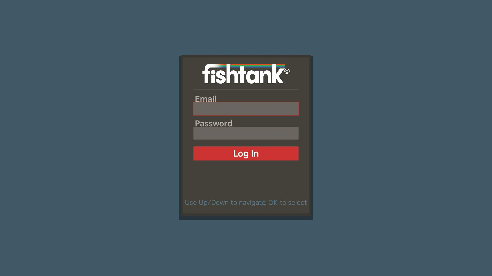
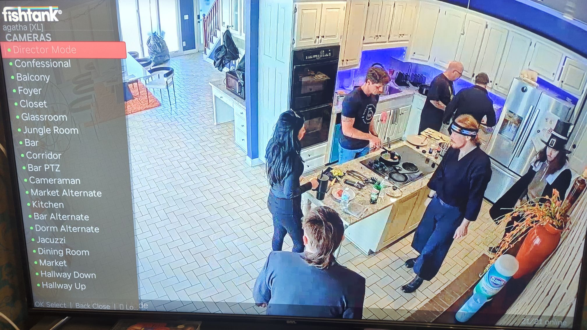

# Fishtank.live Roku PoC

Roku channel for watching Fishtank.live on your TV like a motherfucking boss.

## Features

- Full email/password login flow
- Auto-hiding camera list
- Camera status refreshes
- Pause support
- Full screen player

## Limitations

- No Google authentication flow
- No advanced site features

## Planned Features

- Stox display
- Websocket support for live chat and site message overlays
- Anonymized usage statistics

## Setup

### Enabling Roku Developer Mode

On your Roku remote, go to **Settings → System → About**, then press:
**Home 3x → Up 2x → Right → Left → Right → Left → Right**

Set a developer password when prompted. Note your Roku's IP address.

### Prepare .env

Copy `env.example` to `.env` and populate with values.

### Build and Deploy

Run `make install`.

## Contributors

- [agathanonymous](https://x.com/agathanonymous)
